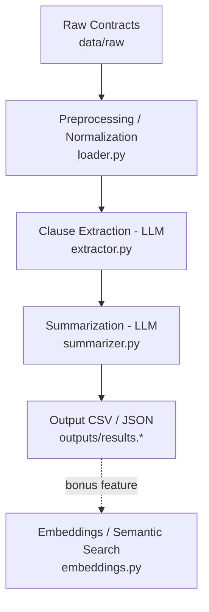

# Contract Clause Extractor

A Python pipeline that uses an LLM to extract key clauses (termination, confidentiality,
liability) from legal contracts and generate plain-language summaries. It's built and evaluated
against a subset of the [CUAD (Contract Understanding Atticus Dataset)](https://www.atticusprojectai.org/cuad),
with an optional semantic search layer over the extracted clauses. The LLM backend is pluggable
(see [Approach](#approach)): it defaults to the Gemini API when a key is available, and falls back
to a local Ollama model otherwise.

> **Reviewing this without running it?** `outputs/results.csv` / `outputs/results.json` are already
> the real, full output of a 50/50-successful run against every contract in `data/raw` — you don't
> need an API key or to run anything to see actual output quality. If you *do* want to run it
> yourself, get a free [Gemini API key](https://aistudio.google.com/apikey) (takes ~30 seconds) and
> run `python run_pipeline.py --n 3` first — that finishes in well under a minute. The local-Ollama
> fallback works with no API key, but is genuinely slow on machines without a dedicated GPU (see
> [Known Limitations](#known-limitations)) — it's a fallback for offline/privacy-sensitive use, not
> the recommended way to evaluate this quickly.

## Project Structure

```
contract-clause-extractor/
├── data/
│   ├── raw/                 # Source contract files (PDF/TXT), gitignored
│   └── processed/           # Cached normalized contract text, gitignored
├── src/
│   ├── loader.py            # Load, normalize, and cache contract text
│   ├── llm_client.py        # LLM client abstraction (Gemini + Ollama implementations)
│   ├── extractor.py         # Clause extraction (termination/confidentiality/liability)
│   ├── summarizer.py        # Plain-language contract summarization
│   ├── pipeline.py          # End-to-end orchestration
│   ├── embeddings.py        # Semantic search over extracted clauses (bonus feature)
│   └── utils.py             # Shared text utilities
├── prompts/                 # LLM prompt templates
├── outputs/                 # Pipeline outputs (CSV/JSON) + Chroma vector store, gitignored
├── tests/                   # pytest suite (no network/API calls required)
└── run_pipeline.py          # CLI entry point
```

## Setup

1. **Python 3.10+** is required.

2. Install dependencies:
   ```
   pip install -r requirements.txt
   ```

3. Set up an LLM backend — either works, `get_default_llm_client()` picks automatically:

   **Option A - Gemini API (recommended, much faster/more reliable):**
   - Get a free API key at [aistudio.google.com/apikey](https://aistudio.google.com/apikey).
   - Copy `.env.example` to `.env` and set `GEMINI_API_KEY=<your key>`.

   **Option B - Local Ollama (offline, no API key, slower):**
   ```
   ollama pull llama3.2:3b
   ```
   Then make sure the Ollama server is running (it usually starts automatically after install;
   otherwise run `ollama serve`). This is used only if `GEMINI_API_KEY` is not set — see
   [Known Limitations](#known-limitations) for why `llama3.2:3b` rather than a larger local model.

4. Copy the environment template if you haven't already:
   ```
   cp .env.example .env
   ```

5. Place contract files (PDF or TXT) in `data/raw/`.

## How to Run

Run the full pipeline (defaults to 50 contracts from `data/raw`, writing to `outputs/results.csv`
and `outputs/results.json`):

```
python run_pipeline.py
```

`outputs/results.csv` / `outputs/results.json` in this repo are the actual output of a real run
against all 50 contracts in `data/raw` (via the Gemini API) — 50/50 processed successfully in
around 6 minutes.

Run it on a smaller batch first (e.g. to sanity-check before scaling up):

```
python run_pipeline.py --n 3
```

Full CLI options:

```
python run_pipeline.py --input_dir data/raw --n 50 --output outputs/results
```

### Semantic search demo (bonus feature)

First, embed the pipeline's output into the vector store:

```python
import json
from src.embeddings import embed_and_store

with open("outputs/results.json") as f:
    results = json.load(f)
embed_and_store(results)
```

Then run the example queries:

```
python src/embeddings.py
```

This prints the top matching clauses (with contract ID, clause type, and similarity score) for a
few sample natural-language queries like *"indemnification obligations"*.

## Testing

```
pytest
```

The suite (`tests/`) covers the logic that doesn't require a real LLM call: JSON parsing/retry/
fallback, prompt-template selection, text normalization edge cases (hyphenation, redaction bars,
header stripping), truncation/localization, per-contract error isolation, and output writing. It
uses fake `LLMClient`/embedding-model stand-ins throughout, so it runs in seconds with no API key,
no Ollama server, and no model downloads required.

## Approach

The pipeline is a straight-line series of stages, each independently testable:

1. **Load & normalize** (`loader.py`) — extract text from PDF/TXT, strip repeated page
   headers/footers and page numbers, normalize typographic characters, and cache the cleaned text
   under `data/processed/` so re-runs skip re-parsing unchanged files.
2. **Extract clauses** (`extractor.py`) — fill a prompt template with the contract text, call the
   LLM, and validate the JSON response against a Pydantic schema. Invalid JSON triggers one retry
   with a stricter instruction before falling back to an explicit failure marker. Supports an
   optional `use_fewshot` toggle (see below).
3. **Summarize** (`summarizer.py`) — a separate prompt/call generates a 100-150 word plain-language
   summary covering purpose, obligations, and risk.
4. **Persist** (`pipeline.py`) — results are collected per contract (with per-contract error
   isolation, so one bad file doesn't kill the batch) and written to both CSV and JSON.
5. **Semantic search** (`embeddings.py`, bonus) — extracted clauses are embedded with
   `sentence-transformers` and stored in ChromaDB, enabling natural-language search across clauses
   independent of exact keyword matches.

**LLM backend abstraction.** `llm_client.py` defines an `LLMClient` interface with a single
`generate(prompt, system=None) -> str` method. `GeminiClient` and `OllamaClient` both implement it;
`get_default_llm_client()` picks `GeminiClient` if `GEMINI_API_KEY` is set, otherwise falls back to
`OllamaClient`. Every other module depends only on the `LLMClient` interface, so `pipeline.py`,
`extractor.py`, and `summarizer.py` never need to know which backend is actually running.

Long contracts are handled differently at each LLM-facing stage, since each task needs different
information from the document (see [Known Limitations](#known-limitations) for the tradeoffs):
clause extraction localizes to keyword-matched paragraphs, while summarization keeps the head and
tail of the document.



## Known Limitations

- **Scanned/image-only PDFs are not OCR'd.** `pdfplumber` only reads embedded text layers; a
  scanned contract with no text layer will silently yield empty or near-empty extracted text
  rather than raising an error. Detecting and OCR'ing these (e.g. with `pytesseract`) is out of
  scope here — for a production system, low-extracted-word-count PDFs should be flagged for an OCR
  fallback or manual review rather than passed through as-is.

- **Long contracts are truncated/localized before hitting the LLM**, and this is stage-specific:
  - `extractor.py` (above ~6,000 words) sends only paragraphs matching clause keyword stems
    (`terminat`, `confidential`, `liab`, `indemnif`) plus one paragraph of surrounding context,
    instead of the full contract. This trades recall for latency/cost/context-window safety — a
    clause phrased without any of these stems (e.g. an unusually worded wind-down provision) could
    be missed.
  - `summarizer.py` (same threshold) instead keeps the head (~70%) and tail (~30%) of the document
    and drops the middle, since a summary needs holistic coverage (purpose, all parties'
    obligations, risk) rather than clause-specific anchors — but a detail buried entirely in the
    dropped middle section would be missed.

- **Local small models vs. a hosted API model.** This was tested empirically, not just assumed.
  On CPU-only/limited-RAM hardware: `llama3.1:8b` took 10-20+ minutes per contract-length call
  (a 50-contract batch would take many hours), a 0.5B model responded in seconds but was too weak
  to follow the flat JSON schema at all, and even `llama3.2:3b` — a reasonable middle ground on
  speed — still failed to reliably produce the exact requested JSON shape (it kept nesting fields
  under its own invented keys instead of the flat `termination_clause`/`confidentiality_clause`/
  `liability_clause` schema). Switching to the Gemini API (`gemini-flash-lite-latest`) resolved both
  problems at once: ~4-8 seconds per call and consistently correct JSON. Running fully local/on-device
  keeps contract text private and has no per-call cost, which matters for genuinely sensitive
  documents — `llm_client.py`'s `LLMClient` abstraction makes that a one-line switch
  (`get_default_llm_client()` falls back to `OllamaClient` automatically whenever `GEMINI_API_KEY`
  isn't set), it just isn't the default given the accuracy/speed difference observed here.

- **Gemini free-tier rate limits.** The free tier caps requests per minute; on a 50-contract batch
  (2 calls each) this was hit intermittently. `GeminiClient.generate()` retries on HTTP 429 and 5xx
  with backoff (429 is specifically excluded from the "fail fast on 4xx" path, since — unlike a bad
  API key or malformed request — it's transient and retrying is exactly correct); a first full run
  without this fix failed 9/50 contracts purely on rate limiting, and a second run with the retry
  fix completed 50/50 successfully.

- **Few-shot prompting experiment.** `extractor.py` supports an optional `use_fewshot` toggle,
  switching to `prompts/clause_extraction_fewshot_prompt.txt` — the same instructions plus 3
  synthetic (not real CUAD) example contract-excerpt → correct-JSON pairs. Run head-to-head on 5
  real contracts, the result was a genuine mixed bag, not a clean win:
  - **2/5 contracts**: identical output either way.
  - **2/5 contracts**: few-shot found *more complete* clauses than zero-shot — e.g. on one contract
    zero-shot's termination clause covered only the breach-cure provision, while few-shot also
    caught a separate termination-for-convenience provision elsewhere in the document; on another,
    few-shot's liability clause included an important indemnification carve-out (excluding gross
    negligence/willful misconduct) that zero-shot missed entirely.
  - **1/5 contracts**: few-shot did *worse* — it picked a narrower, less relevant clause (an
    independent-contractor tax-liability provision) over the contract's actual primary mutual
    indemnification clause, which zero-shot correctly identified.
  - One few-shot response also joined two non-adjacent excerpts with a literal `"..."`, technically
    violating the "quote verbatim, don't paraphrase" instruction — likely because the worked
    examples implicitly suggested that combining relevant fragments was acceptable.

  Takeaway: with a strong model (Gemini), few-shot examples nudge extraction toward finding
  *additional* relevant clauses scattered across the document, at some risk of it also latching onto
  a superficially similar but wrong clause, or bending the "verbatim" rule to stitch fragments
  together. Neither mode strictly dominates on this small sample — this is exactly the kind of
  tradeoff that would need a larger, ground-truth-annotated sample (e.g. CUAD's own annotations,
  rather than the synthetic examples used here) to evaluate rigorously before picking a default.

## Requirements

- Python 3.10+
- See `requirements.txt` for dependencies.
